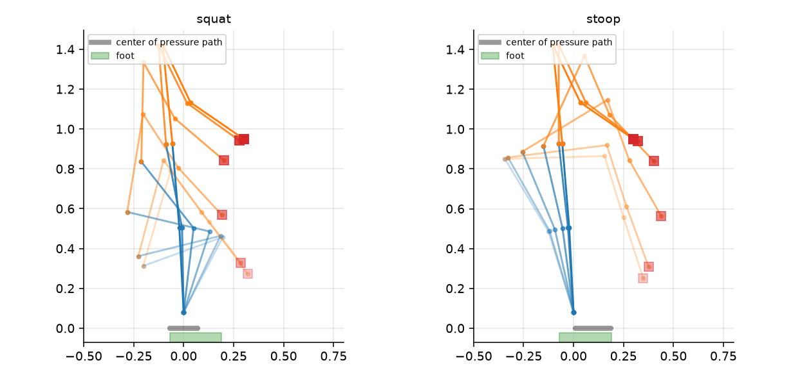
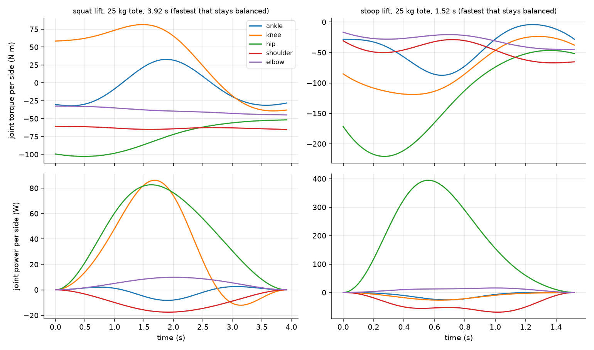
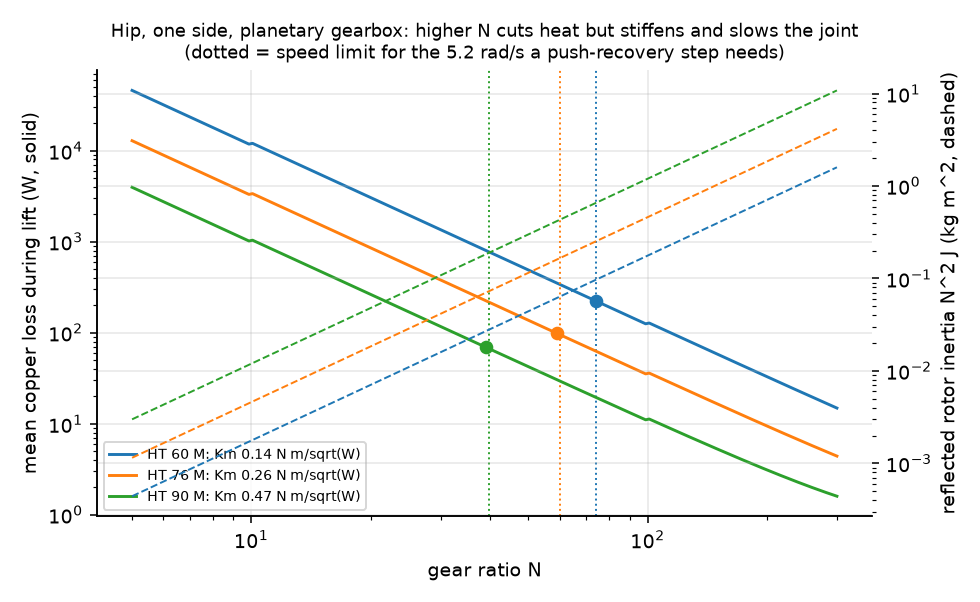
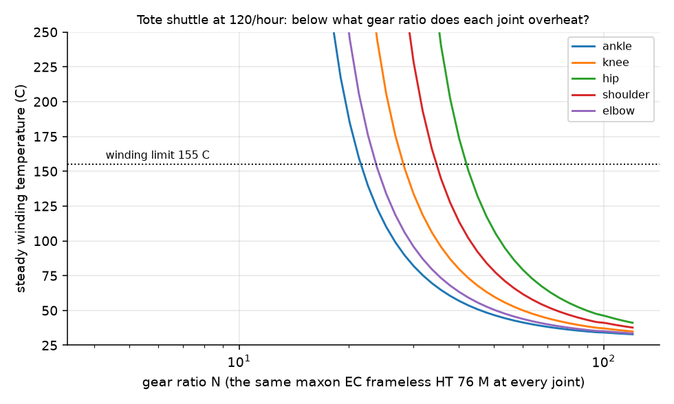
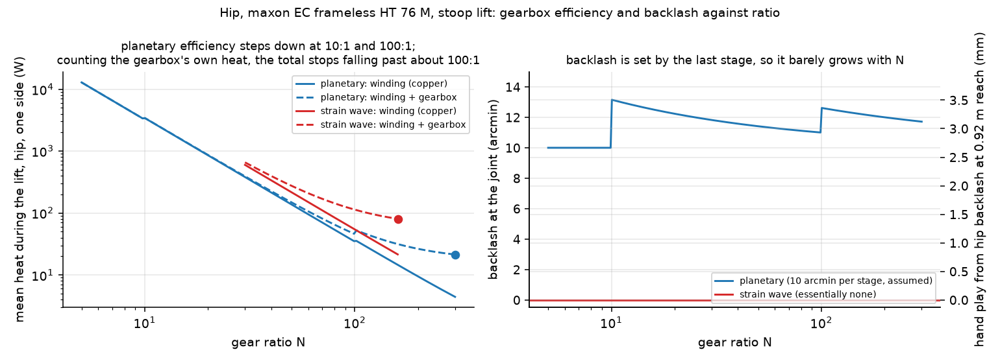
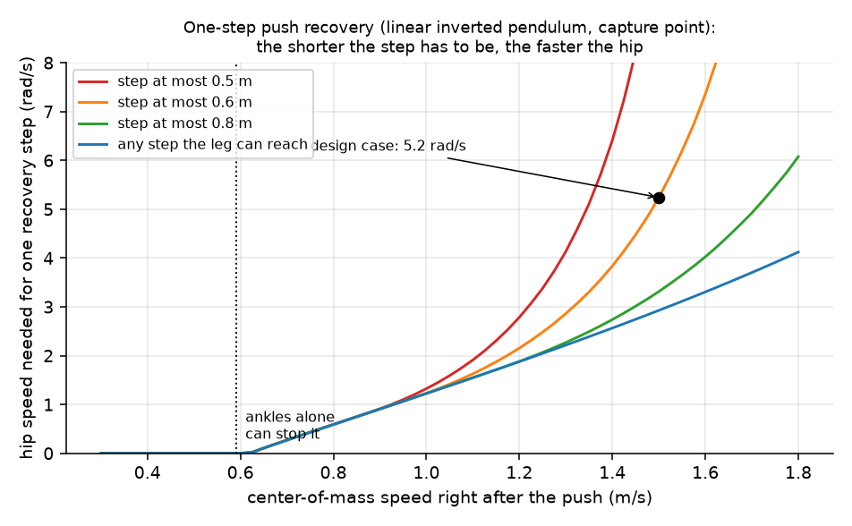
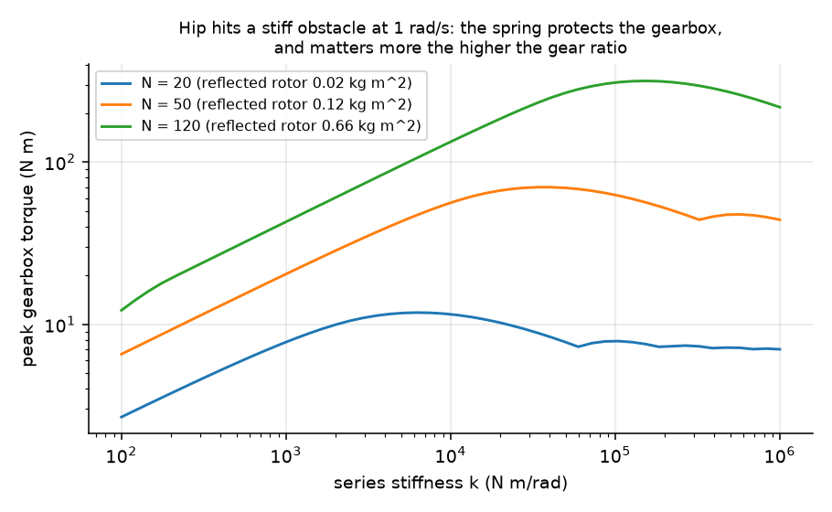

# actuator-sizer

[](https://github.com/aneeshkaravadi/actuator-sizer/actions/workflows/ci.yml)

How big does a humanoid robot's hip motor need to be if its job is moving 25 kg totes all day? This repo works it out from the task backwards: simulate the lift, get the torque every joint needs, then pick motors and gear ratios and see what overheats.



## The model

It's a human-sized robot (1.73 m, 73 kg) in MuJoCo, simplified to a side view with both legs and both arms lumped together, since a two-handed lift is symmetric. Segment lengths and masses come from human anthropometry tables (Winter), which is roughly where human-scale humanoids end up anyway. The robot plans a pick posture and a finish posture with inverse kinematics, blends between them with a minimum-jerk profile, and MuJoCo's inverse dynamics tells me the torque at each joint at every instant. The feet are bolted down, so I check balance separately by tracking where the center of pressure lands under the foot.

The first sanity check I trusted: over a whole lift, the total work done by all the joints matches the gain in potential energy to within 1%.

## What one lift needs

Per side, for a stoop lift in 1.5 s, the hip is doing almost all the work: 221 N·m peak and almost 400 W. A squat lift cuts hip torque roughly in half, which is the "lift with your legs" advice working the way you'd expect.



## Balance turned out to be the real limit

This was the surprise. When I tried to speed up the squat lift, the center of pressure ran off the back of the heel, because rising quickly out of a deep squat throws the body backwards. The fastest squat that stays balanced takes 3.9 s, against 1.5 s for the stoop. So for a robot with feet this size, lifting with your legs costs you 2.6 times the cycle time, which is a pretty big deal if the whole point is throughput.

## Picking a gear ratio

I expected to find an optimal gear ratio and got something else. For a slow lift that's mostly fighting gravity, motor heat keeps going down the higher you make the ratio, forever. What actually stops you is everything else a high ratio costs: the joint can't move fast anymore, and the motor's rotor inertia gets multiplied by N², which you feel in every collision. So the plot on the left is a trade space, not an answer, and the dotted lines are where the hip gets too slow to catch the robot after a hard shove (next section).

 

On the right, the same mid-size motor at every joint (maxon's EC frameless HT 76 M, next section) does 120 totes an hour (lift, carry, lower, walk back). The hip overheats first, below about 43:1, and the shoulder holding the tote out in front is next at about 36:1. That rules out the low ratios that make a robot backdrivable and safe around people (6 to 10:1) for a motor this size.

## Real motors instead of made-up ones

My first version used three motors I'd made up to span a realistic range. Swapping in three real frameless kits from maxon's catalog changed the answer a lot. These are the EC frameless HT 60 M, 76 M and 90 M, with every number from their product pages. The real kits are lighter (226 to 649 g) and have lower motor constants (0.14 to 0.47 N·m/√W, against 0.22 to 1.24 for mine), so they make more heat for the same torque. My made-up mid-size motor had said 12:1 was enough at the hip for the shuttle. The real one needs 43:1.

With real motors the shuttle sets a minimum ratio at the hip, from heat, and the push recovery (below) sets a maximum, from speed. A motor only works if there's room between the two. The 226 g kit has none: it needs 95:1 to stay cool, but past 74:1 it's too slow. The 376 g kit works from 43 to 60:1, and the 649 g kit from 21 to 40:1.

Two details came out of the datasheets. maxon gives two thermal resistances and two time constants instead of one, so the winding temperature model now has two nodes: the winding heats up in under a minute and a half, the housing over several minutes. And the listed stall torque is far below the torque constant times the stall current, because the iron saturates, so I cap the current at the listed stall torque. The tests cross-check the datasheet numbers against each other (torque constant against speed constant, stall current against V/R), which would catch a typo.

## What the gearbox costs

I first used a constant 90% gearbox efficiency. A real planetary gearbox adds a stage for every 10:1 or so, and each stage costs a few percent, so I made efficiency step down with the number of stages (0.97 per stage, an assumption) and counted the gearbox's own friction heat too. The winding heat keeps falling with ratio, but the gearbox's share keeps growing, and past about 140:1 the gearbox makes most of the heat. Each extra stage also costs a step: the total goes from 45.6 W at 100:1 to 52.9 W just past it, once a third stage is needed.

Lowering a tote runs the gearbox backwards, with the load driving the motor, and then friction helps hold the load instead of fighting the motor. For friction-type losses the backwards efficiency is $2 - 1/\eta$, so the motor needs less torque going down than coming up. The shuttle numbers above include that.

A strain-wave gearbox gets a high ratio in one stage with essentially no backlash, but at an assumed 75% efficiency it makes 1.9 times the heat of a two-stage planetary at 50:1 (274 W against 148 W), and five times the gearbox heat. Backlash barely depends on the ratio, because each stage's play reaches the output divided by the ratio of the stages after it, so the last stage sets it. At 50:1 that's about 11 arcmin, which lets the hands wander about 3 mm at the hip's 0.92 m reach.



## How fast does the hip need to be?

The gear-ratio trade needs a top speed for the hip, and at first I just assumed 6 rad/s. To get it from an actual task instead, I looked at about the fastest thing a hip has to do, which is catching the robot with one step after a shove. I treated the robot as an inverted pendulum, with its center of mass at 1.02 m, taken from the MuJoCo model. A push that leaves the center of mass moving slower than 0.59 m/s can be stopped by the ankles alone. Anything harder needs a step, and the foot has to land where the robot's capture point has got to by then, which runs away exponentially. A slow step needs a long stride, and a short stride needs a fast step.

So the hip speed you need depends as much on how far the robot is allowed to step as on the push. With unlimited stride, a 1.5 m/s shove needs only 2.9 rad/s at the hip. With the step capped at 0.6 m it needs 5.2 rad/s, landing 0.15 s after the push, and at 0.5 m it can't be done at all. I used that 5.2 rad/s case for the dotted lines above. It came out close to my guess, but now it comes from a push and a stride length you can argue about. It also assumes the robot reacts instantly, so a real one needs more.



## Do series springs help?

I modeled the hip running into something stiff at 1 rad/s, with a spring between the gearbox and the leg. At a 120:1 ratio a 3000 N·m/rad spring cuts the shock on the gearbox from 218 to 74 N·m, but at 20:1 it actually makes it worse (11 against 7 N·m), because there's not much rotor inertia to protect against in the first place. The cost of the spring is 0.074 rad of deflection at peak hip torque.



There's also a quick air-core vs iron-core motor comparison ([figure](docs/figures/aircore_vs_iron.png)) and a CAD envelope for the hip actuator: motor bay, gearbox bay and output flange ([STEP](cad/hip_actuator_envelope.step)).

<!-- TODO(Aneesh): replace or add next to the generated envelope with your own SolidWorks model, e.g.

and put the native file in cad/solidworks/
-->

## Things I got wrong first

- My first inverse dynamics run said the hip needed about 40,000 N·m. The body and the tote were sinking into the floor in the stoop posture and MuJoCo was adding contact forces. Turning contacts off (the feet are fixed anyway) fixed it.
- My "squat" inverse kinematics kept quietly turning into a stoop, because it started from a standing pose and found the nearest answer. Seeding it from a squat posture fixed that.
- Both lifts originally put the center of pressure past the toes, until I made balance a much stronger term in the posture solver and moved the tote closer to the body.
- My first thermal study used a 120:1 ratio everywhere and nothing came close to overheating, which told me nothing. Sweeping the ratio is what made it useful.

## Running it

```bash
pip install -e ".[dev,cad]"
pytest -q
python examples/make_figures.py
```

The motors are three maxon frameless kits, with every number from maxon's product pages, and the made-up ones I started with are still in the code as `ILLUSTRATIVE_MOTORS`. The physics is written out in [DERIVATIONS.md](DERIVATIONS.md). Open questions and next steps are in [issues](https://github.com/aneeshkaravadi/actuator-sizer/issues).

---

Aneesh Karavadi, dual-enrolled engineering student at UNT through TAMS. I do most of my CAD in SolidWorks, Fusion and Onshape. I used Claude Code to write a lot of the implementation, but the questions, the checks and the conclusions are mine.
